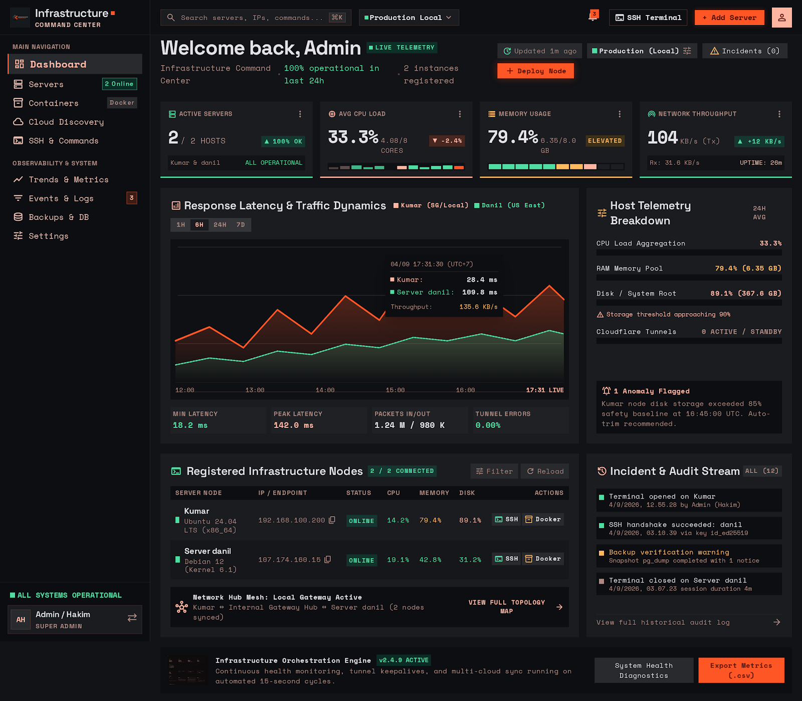
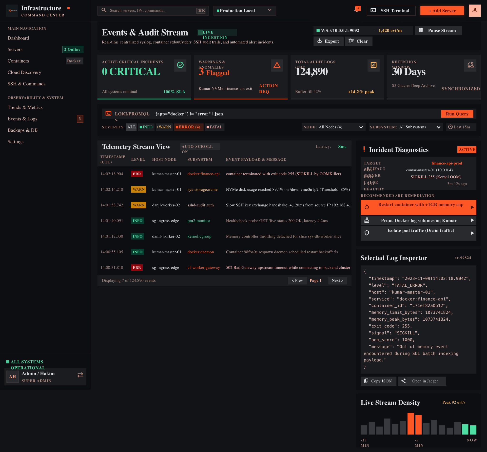
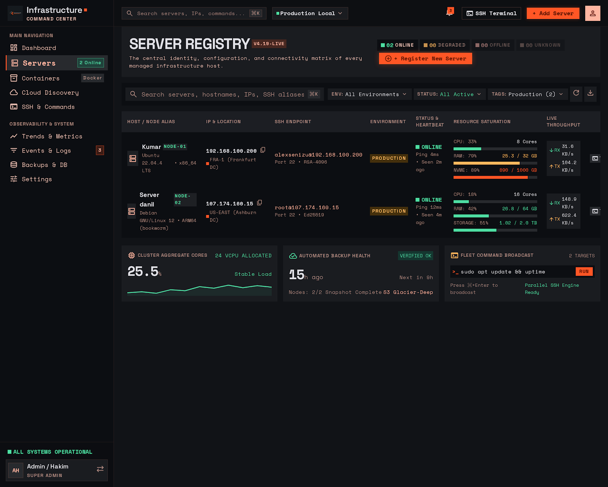
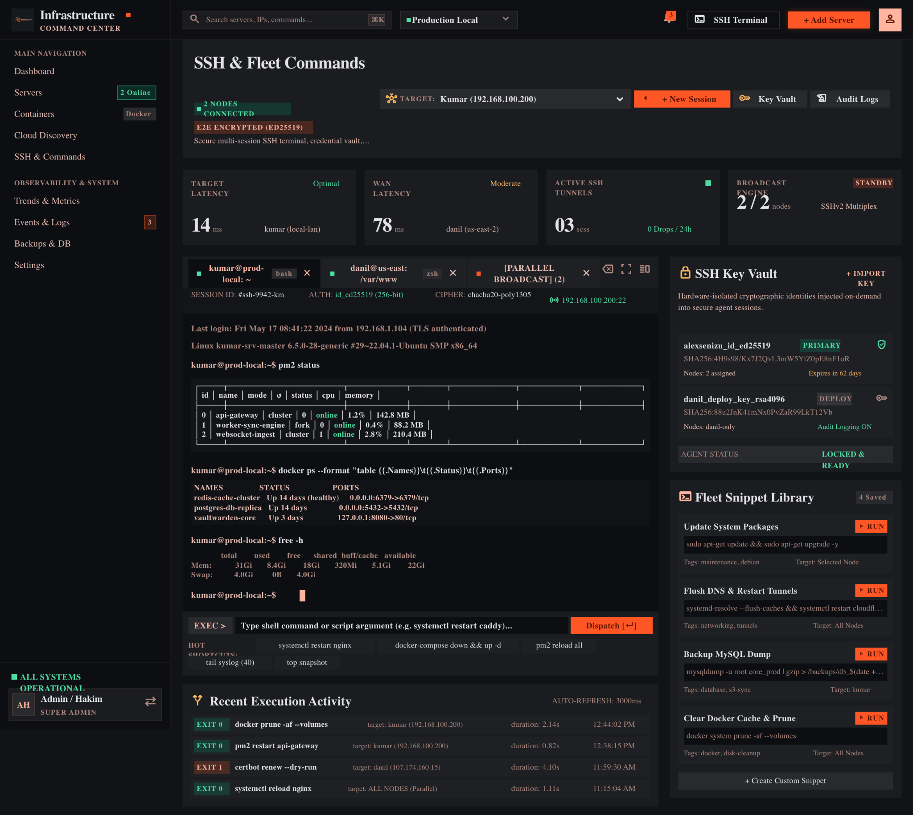
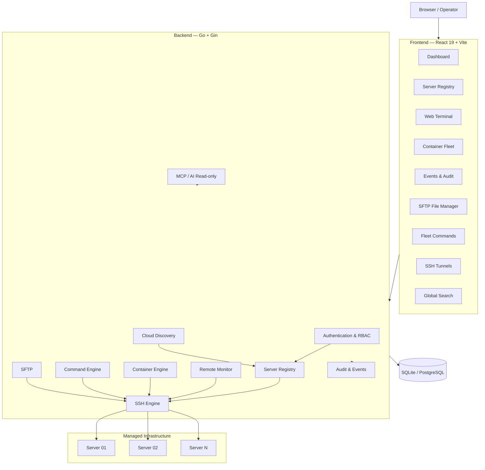

# 🖥️ ServerMonitoring

### Infrastructure Command Center for Multi-Server Operations

> **Monitor. Understand. Investigate. Act. Verify.**

**ServerMonitoring** is a self-hosted infrastructure monitoring and management platform designed to bring **server observability, SSH operations, container management, file access, tunnels, audit events, and AI-assisted infrastructure inspection** into a single command center.

What began as a simple VPS monitoring dashboard has evolved into a multi-host infrastructure platform with an **agentless SSH architecture**: remote servers do not require a dedicated monitoring agent. The platform communicates with managed hosts through SSH and provides a unified operational view from the browser.

<p align="center">
  <a href="https://github.com/KarmaSenzu/ServerMonitoring"><strong>Repository</strong></a> ·
  <a href="#-quick-start"><strong>Quick Start</strong></a> ·
  <a href="#-screenshots"><strong>Screenshots</strong></a> ·
  <a href="#-architecture"><strong>Architecture</strong></a>
</p>

<p align="center">
  
  
  
  
  
  
</p>

---

## 🎯 Why ServerMonitoring?

Managing infrastructure often means jumping between terminals, SSH clients, Docker commands, monitoring tools, cloud dashboards, and log viewers.

ServerMonitoring brings these operational tasks into one interface:

```text
                    ┌─────────────────────────────┐
                    │   Infrastructure Command    │
                    │          Center             │
                    └──────────────┬──────────────┘
                                   │
             ┌─────────────────────┼─────────────────────┐
             │                     │                     │
        OBSERVE                 INVESTIGATE            ACT
             │                     │                     │
     Metrics & Health        Events & Audit        SSH & Commands
     CPU / RAM / Disk        Logs & Incidents      Containers
     Network / Uptime        Server Discovery      SFTP / Tunnels
             │                     │                     │
             └─────────────────────┼─────────────────────┘
                                   │
                                VERIFY
                                   │
                         Health + Audit Trail
```

The goal is not simply to **display server metrics**, but to create an operational workflow where infrastructure can be observed, investigated, operated, and verified from one place.

---

## ✨ Core Capabilities

| Area | Capability |
|---|---|
| 📡 **Monitoring** | CPU, memory, disk, load, network, uptime, latency and host health |
| 🗂️ **Server Registry** | Central inventory for hosts, IPs, SSH endpoints, tags, environments and status |
| 🐳 **Container Fleet** | Inspect and operate Docker/Podman containers across managed servers |
| 💻 **Web Terminal** | Interactive SSH terminal directly from the browser using xterm.js + PTY |
| ⚡ **Fleet Commands** | Execute reusable commands across multiple hosts with execution tracking |
| 📁 **SFTP File Manager** | Browse, upload, download, rename, delete and create directories remotely |
| 🔐 **SSH Key Vault** | Manage SSH identities and private-key metadata securely |
| 🔗 **SSH Tunnels** | Local forwarding, remote forwarding and SOCKS5 tunneling |
| ☁️ **Cloud Discovery** | Discover infrastructure and import hosts into the server registry |
| 🔎 **Global Search** | Search infrastructure entities from a single command palette |
| 🚨 **Events & Audit** | Centralized telemetry, warnings, errors, incidents and audit activity |
| 👥 **RBAC** | Viewer, Operator and Admin access levels |
| 🤖 **MCP / AI** | Read-only infrastructure context exposed to AI agents through MCP |
| 💾 **Database Backends** | SQLite by default with PostgreSQL/Supabase support |
| 📦 **Deployment** | Docker Compose or a self-contained single binary |

---

# 📸 Screenshots

The following screenshots show the current interface and the operational workflow of the platform.

## 01 — Infrastructure Dashboard

**The operational overview.** The dashboard combines host health, CPU and memory utilization, network throughput, latency, telemetry trends, registered infrastructure nodes, and recent incidents into one command-center view.



> **At a glance:** observe infrastructure health before deciding where to investigate or act.

---

## 02 — Events & Audit Stream

**The investigation layer.** Centralized telemetry makes it possible to inspect warnings, errors, container failures, SSH events, health checks, and operational incidents without switching between multiple systems.



> **From signal to context:** identify an abnormal event, inspect its payload, understand the affected service, and surface a possible remediation path.

---

## 03 — Server Registry

**The infrastructure inventory.** Every managed host has a centralized identity containing its endpoint, environment, connectivity status, resource saturation, and live throughput.



> **One registry, many hosts:** move from individual server management toward a unified infrastructure fleet model.

---

## 04 — SSH & Fleet Commands

**The execution layer.** Interactive SSH sessions, parallel fleet commands, SSH key identities, reusable snippets, and execution history are brought into the same operational workspace.



> **Observe → execute → verify:** infrastructure operations can be performed directly from the same command center used for monitoring.

---

# 🧭 Product Workflow

ServerMonitoring is structured around an operational loop:

### 1. Monitor

Collect health and resource information from local and remote hosts.

### 2. Understand

Use trends, server metadata, telemetry, and system state to understand what is happening.

### 3. Investigate

Inspect events, audit streams, logs, container state, SSH connectivity, and discovered services.

### 4. Act

Run commands, open terminals, operate containers, transfer files, manage tunnels, or perform other authorized infrastructure actions.

### 5. Verify

Review execution results, health state, audit records, and subsequent telemetry.

```text
MONITOR
   ↓
UNDERSTAND
   ↓
INVESTIGATE
   ↓
ACT
   ↓
VERIFY
   ↺
```

---

# 🏗️ Architecture

ServerMonitoring uses a web frontend backed by a Go service layer. Remote infrastructure is accessed through an **agentless SSH model**.



### Communication model

- **HTTP** — standard API communication
- **WebSocket** — interactive terminal sessions
- **SSE** — real-time metrics/events where applicable
- **SSH** — agentless communication with remote servers
- **SFTP** — remote file operations

---

# 🧩 Architecture Principles

### Agentless by Design

Remote hosts do not need a dedicated monitoring agent. The platform uses SSH to collect metrics and execute authorized operations.

### Centralized Infrastructure Identity

Servers are represented through a registry rather than being treated as isolated SSH targets.

### Separation of Observation and Action

Monitoring and read operations provide infrastructure context, while privileged operations are protected by authentication and RBAC.

### Auditable Operations

Mutating infrastructure actions are designed to leave an operational trail so that actions can be investigated after execution.

### Safety-Aware Execution

The command layer includes timeouts, output limits, danger classification, and safe execution mechanisms rather than blindly interpolating arbitrary shell commands.

### Single-Binary Deployment

The production build can package the Go backend and React frontend into a self-contained binary, reducing deployment complexity.

---

# 🛠️ Tech Stack

| Layer | Technology |
|---|---|
| **Backend** | Go 1.25+, Gin |
| **Frontend** | React 19, Vite |
| **Data Fetching** | TanStack Query |
| **Charts** | Recharts |
| **Terminal** | xterm.js + PTY |
| **SSH** | `golang.org/x/crypto/ssh` |
| **SFTP** | `github.com/pkg/sftp` |
| **Database** | SQLite / PostgreSQL |
| **Realtime** | WebSocket + SSE |
| **Containers** | Docker / Podman |
| **Reverse Proxy** | Nginx |
| **Deployment** | Docker Compose / Single Binary |
| **AI Integration** | MCP / JSON-RPC |

---

# 🚀 Quick Start

## Option A — Single Binary

Recommended for a simple production-style deployment.

```bash
git clone https://github.com/KarmaSenzu/ServerMonitoring.git
cd ServerMonitoring/vps-dashboard

# Build frontend + backend into the application binary
./scripts/build.sh

# Generate a strong JWT secret
export JWT_SECRET="$(openssl rand -base64 32)"

# Set an initial admin password
export BOOTSTRAP_ADMIN_PASSWORD="change-this-password"

# Start
./vpsdash
```

Open:

```text
http://localhost:3001
```

---

## Option B — Docker Compose

```bash
git clone https://github.com/KarmaSenzu/ServerMonitoring.git
cd ServerMonitoring/vps-dashboard

cp .env.docker.example .env.docker

# Edit the environment file before starting
nano .env.docker

# Start the stack
docker compose up -d --build
```

Open:

```text
http://localhost
```

---

# 💻 Local Development

## Backend

```bash
cd vps-dashboard/backend-go

cp .env.example .env

export JWT_SECRET="dev-secret-change-me"
export BOOTSTRAP_ADMIN_PASSWORD="change-me"

go mod tidy
go run ./cmd/api/
```

Backend:

```text
http://localhost:3001
```

## Frontend

```bash
cd vps-dashboard/frontend

npm install
npm run dev
```

Frontend:

```text
http://localhost:5173
```

The Vite development server proxies API requests to the backend.

---

# ⚙️ Configuration

The primary configuration is environment-based.

| Variable | Default | Purpose |
|---|---|---|
| `JWT_SECRET` | required | JWT signing secret |
| `BOOTSTRAP_ADMIN_USERNAME` | `admin` | Initial administrator username |
| `BOOTSTRAP_ADMIN_PASSWORD` | required | Initial administrator password |
| `HTTP_ADDR` | `:3001` | Backend listen address |
| `DB_PATH` | `./data/vps-dashboard.db` | SQLite database path |
| `CORS_ORIGINS` | `http://localhost:5173` | Allowed origins |
| `SSH_KEYS_DIR` | `./data/ssh-keys` | Private SSH key storage |
| `REMOTE_POLL_INTERVAL` | `60s` | Remote metric collection interval |
| `REMOTE_MAX_PARALLEL` | `4` | Maximum concurrent SSH probes |
| `REMOTE_COMMAND_TIMEOUT` | `15s` | Remote metric command timeout |
| `REMOTE_RETENTION` | `24h` | Metric retention period |
| `MCP_API_KEY` | disabled | Enables MCP/AI endpoint when configured |
| `MCP_AUDIT_PATH` | `./data/mcp-audit.jsonl` | MCP audit log path |

See [`vps-dashboard/.env.example`](./vps-dashboard/.env.example) and [`vps-dashboard/.env.docker.example`](./vps-dashboard/.env.docker.example) for the repository templates.

---

# 🗄️ Database

SQLite is the default backend and requires no external database service.

```text
SQLite
  │
  ├── zero-config
  ├── local database file
  └── suitable for simple/self-hosted deployments
```

PostgreSQL is also supported for deployments that require an external database backend.

The repository also contains an optional database-cluster configuration under [`database-cluster/`](./database-cluster/).

---

# 🔐 Security Model

Security is treated as part of the infrastructure workflow rather than as an afterthought.

### Authentication

- JWT-based authentication
- HTTP-only cookie authentication for browser sessions
- Separate API-key authentication for MCP

### Authorization

Three RBAC levels are provided:

| Capability | Viewer | Operator | Admin |
|---|:---:|:---:|:---:|
| View infrastructure | ✅ | ✅ | ✅ |
| View metrics/events | ✅ | ✅ | ✅ |
| Run SSH commands | ❌ | ✅ | ✅ |
| Open terminal | ❌ | ✅ | ✅ |
| Operate containers | ❌ | ✅ | ✅ |
| Multi-host commands | ❌ | ✅ | ✅ |
| File operations | ❌ | ✅ | ✅ |
| Manage users | ❌ | ❌ | ✅ |
| Manage SSH keys | ❌ | ❌ | ✅ |
| Manage server registry | ❌ | ❌ | ✅ |
| Manage tunnels/snippets | ❌ | ❌ | ✅ |

### SSH Security

- Ed25519 key generation
- Private-key storage with restricted permissions
- SSH host-key verification using TOFU
- Host-key fingerprint visibility
- Connection testing before operations
- Timeouts and output limits for remote commands

### Command Safety

The execution layer is designed around controlled execution rather than unrestricted shell interpolation.

Additional safeguards include:

- command timeouts
- output-size limits
- dangerous-command classification
- blast-radius preview for multi-host operations
- audit records for mutating operations

### SFTP Safety

Remote file operations include path sanitization to reduce path-traversal risks.

---

# 🐳 Container Fleet

ServerMonitoring can provide a unified view of containers running across managed hosts.

Supported operations include:

- discover Docker or Podman
- list containers
- inspect container state
- start containers
- stop containers
- restart containers
- inspect container logs

The interface presents containers as a common fleet model regardless of the underlying container engine.

---

# 💻 Web Terminal

The browser terminal provides an interactive SSH session without requiring the operator to leave the command center.

```text
Browser
   │
   │ WebSocket
   ▼
ServerMonitoring
   │
   │ SSH + PTY
   ▼
Remote Server
```

The terminal uses **xterm.js** on the frontend and a PTY-backed SSH session on the backend.

---

# ⚡ Multi-Host Command Engine

Reusable snippets can be dispatched to multiple infrastructure nodes.

The workflow is designed around controlled execution:

```text
Select Targets
      ↓
Preview Blast Radius
      ↓
Classify Command
      ↓
Execute in Parallel
      ↓
Collect Per-Host Results
      ↓
Write Audit Trail
```

This makes fleet operations more structured than manually opening separate SSH sessions for every host.

---

# 📁 SFTP File Manager

The file-management layer provides remote filesystem operations through SFTP.

Supported operations include:

- browse directories
- upload
- download
- rename
- delete
- create directories
- path validation / sanitization

---

# 🔗 SSH Tunnels

The SSH engine supports several forwarding modes:

| Mode | Description |
|---|---|
| `-L` | Local port forwarding |
| `-R` | Remote port forwarding |
| `-D` | SOCKS5 dynamic forwarding |

Tunnel definitions can be managed from the infrastructure interface.

---

# ☁️ Cloud Discovery

The cloud-discovery layer provides a provider abstraction for discovering infrastructure and importing hosts into the central registry.

The important design principle is that discovery should feed the same **Server Registry** used by manually registered hosts.

```text
Cloud Provider
      ↓
Discovery
      ↓
Normalize Host Metadata
      ↓
Server Registry
      ↓
Monitoring / SSH / Operations
```

---

# 🔎 Global Infrastructure Search

The command palette provides a centralized search interface for infrastructure data.

Use:

```text
Ctrl + K
```

or:

```text
⌘ + K
```

Depending on the operating system.

Search can be used to navigate across infrastructure entities such as servers, commands, tunnels, and tags.

---

# 🚨 Events & Audit

The event stream is designed to provide operational visibility beyond simple CPU/RAM graphs.

Examples of events include:

- SSH activity
- container events
- health checks
- warnings
- errors
- incidents
- command execution activity
- infrastructure changes

The objective is to preserve the operational context around **what happened, where it happened, and what action followed**.

---

# 🤖 MCP / AI Integration

ServerMonitoring includes a read-only MCP/AI interface for exposing infrastructure context to AI agents.

When enabled, the MCP endpoint uses an API key and maintains an audit log.

Example configuration:

```bash
export MCP_API_KEY="your-secret-api-key"
export MCP_AUDIT_PATH="./data/mcp-audit.jsonl"
```

Example tool discovery:

```bash
curl \
  -H "X-API-Key: your-secret-api-key" \
  http://localhost:3001/mcp/tools
```

The intended model is:

```text
AI Agent
   │
   │ MCP / JSON-RPC
   ▼
ServerMonitoring
   │
   ├── Servers
   ├── Metrics
   ├── Events
   ├── Containers
   └── Infrastructure Context
```

> **Important:** The MCP integration is designed as **read-only**. AI agents can query infrastructure context without receiving direct mutation capabilities through the MCP layer.

---

# 🧱 Development Phases

The platform evolved through a series of feature phases:

| Phase | Focus |
|---:|---|
| 1 | Server Registry |
| 2 | SSH Engine |
| 3 | Remote Monitoring |
| 4 | Docker / Podman Fleet |
| 5 | Interactive Terminal |
| 6 | Multi-Host Commands |
| 7 | SFTP File Manager |
| 8 | SSH Tunnels |
| 9 | Cloud Discovery |
| 10 | Infrastructure Search |
| 11 | RBAC |
| 12 | MCP / AI Integration |

This progression reflects the project's direction from **monitoring** toward **infrastructure management**.

---

# 📁 Project Structure

```text
ServerMonitoring/
├── README.md
├── database-cluster/                 # Optional PostgreSQL cluster
│   ├── docker-compose.yml
│   ├── .env.example
│   ├── config/
│   ├── init-scripts/
│   ├── pgadmin/
│   └── scripts/
│
├── vps-dashboard/                    # Main application
│   ├── backend-go/                   # Go backend
│   │   ├── cmd/api/                  # Application entry point
│   │   └── internal/
│   │       ├── app/                  # Dependency injection
│   │       ├── auth/                 # Authentication
│   │       ├── config/               # Configuration
│   │       ├── db/                   # Database + migrations
│   │       ├── models/               # Models + repositories
│   │       ├── alerts/               # Alert engine
│   │       ├── backup/               # Backup scheduler
│   │       ├── cloud/                # Cloud discovery
│   │       ├── commands/             # Fleet command engine
│   │       ├── containers/           # Container fleet
│   │       ├── deploy/               # Deployment service
│   │       ├── discovery/            # Project/service discovery
│   │       ├── docker/               # Local Docker management
│   │       ├── files/                # SFTP file manager
│   │       ├── healthcheck/          # Health checks
│   │       ├── mcp/                  # MCP server
│   │       ├── notifier/             # Notifications
│   │       ├── pm2/                  # PM2 management
│   │       ├── remote/               # Remote monitoring
│   │       ├── safeexec/             # Safe command execution
│   │       ├── search/               # Infrastructure search
│   │       ├── ssh/                  # SSH + tunnels
│   │       ├── sysinfo/              # Local system metrics
│   │       └── tunnel/               # Tunnel management
│   │
│   ├── frontend/                     # React frontend
│   │   ├── src/
│   │   │   ├── api/
│   │   │   ├── auth/
│   │   │   ├── components/
│   │   │   ├── pages/
│   │   │   └── ui/
│   │   ├── Dockerfile
│   │   └── vite.config.js
│   │
│   ├── scripts/                      # Build/deployment scripts
│   ├── docker-compose.yml
│   └── nginx-dashboard.conf
│
└── PROJECT ARCHITECTURE.md            # Detailed architecture documentation
```

---

# 🧪 Testing

Backend tests:

```bash
cd vps-dashboard/backend-go
go test ./... -count=1
```

Frontend lint and production build:

```bash
cd vps-dashboard/frontend
npm run lint
npm run build
```

---

# 📡 API Surface

The platform exposes authenticated HTTP APIs for infrastructure operations.

### Authentication

```text
POST /auth/login
POST /auth/logout
GET  /auth/me
```

### Servers

```text
GET    /servers
POST   /servers
GET    /servers/:id
PUT    /servers/:id
PATCH  /servers/:id
DELETE /servers/:id
GET    /servers/tags
GET    /servers/:id/metrics
GET    /servers/:id/history
GET    /servers/:id/discovery
```

### SSH

```text
GET    /ssh/keys
POST   /ssh/keys
POST   /ssh/keys/generate
GET    /ssh/keys/:name/public
DELETE /ssh/keys/:name
POST   /ssh/test/:id
POST   /ssh/command/:id
```

For the complete endpoint inventory, see [`PROJECT ARCHITECTURE.md`](./PROJECT%20ARCHITECTURE.md).

---

# 🖥️ Deployment Modes

ServerMonitoring supports several deployment styles depending on the environment.

### Single Binary

```text
Go Backend
    +
Embedded React Frontend
    ↓
  vpsdash
```

Best for simple self-hosted installations and low operational overhead.

### Docker Compose

```text
Nginx
  ↓
React / Web Layer
  ↓
Go Backend
  ↓
Database
```

Best when the application is managed as part of a containerized infrastructure stack.

### Development Mode

```text
React / Vite :5173
        ↓
Go API :3001
```

Best for active frontend/backend development.

---

# 🛣️ Project Direction

The project has evolved from a basic monitoring dashboard into an infrastructure command center.

The broader direction is:

```text
Server Monitoring
       ↓
Multi-Host Observability
       ↓
Infrastructure Operations
       ↓
Automation
       ↓
AI-Assisted Infrastructure
```

The architecture is intentionally modular so monitoring, SSH operations, containers, file management, tunnels, discovery, audit streams, and AI integrations can evolve independently while sharing a common infrastructure model.

---

# 📚 Documentation

Additional technical documentation is available in:

- [`PROJECT ARCHITECTURE.md`](./PROJECT%20ARCHITECTURE.md) — detailed architecture and implementation documentation
- [`IMPLEMENTATION_SUMMARY.md`](./IMPLEMENTATION_SUMMARY.md) — implementation summary
- [`vps-dashboard/.env.example`](./vps-dashboard/.env.example) — development configuration template
- [`vps-dashboard/.env.docker.example`](./vps-dashboard/.env.docker.example) — Docker configuration template

---

# 🤝 Contributing

Contributions, feedback, and technical discussion are welcome.

Before submitting a change:

1. Keep security-sensitive configuration out of Git.
2. Run backend tests.
3. Run frontend lint/build checks.
4. Document changes that affect deployment or architecture.
5. Avoid exposing private keys, credentials, server addresses, or production secrets in screenshots or commits.

---

# 📄 License

This project is released under the **MIT License**.

---

## 👨‍💻 Author

**Damar Fikrie**

IT Full Stack Developer · Backend · Infrastructure · AI Systems

[GitHub](https://github.com/KarmaSenzu)

---

<p align="center">
  <sub>Built to turn infrastructure operations into a single, observable command center.</sub>
</p>
